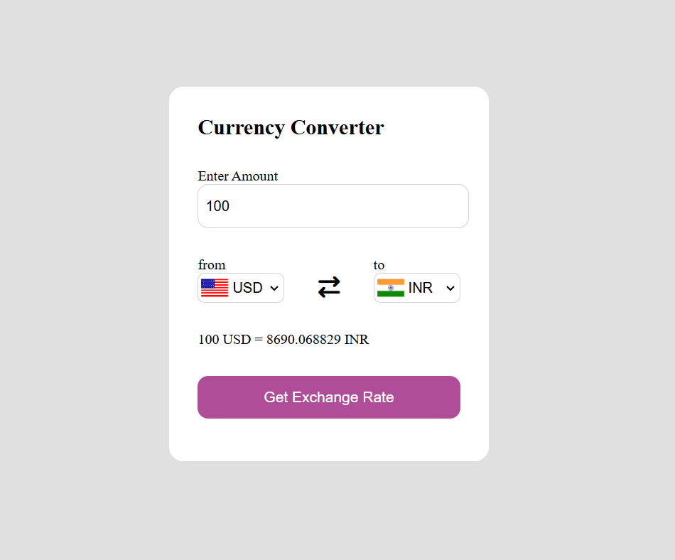

# 💱 Currency Converter

A simple and modern currency converter web app that allows users to convert between 200+ currencies, including cryptocurrencies and metals. Built using HTML, CSS, and JavaScript. Uses the [Fawaz Ahmed Currency API](https://github.com/fawazahmed0/currency-api) for real-time exchange rates.

---

## 🚀 Features

- 🌍 Convert between 200+ currencies
- 🔁 Real-time exchange rates
- 🏳️ Flags update automatically on currency change
- 🧮 Auto fallback to default amount if input is empty
- 🔥 Blazing fast API with no rate limits

---

## 💻 Preview



---

## 🌐 Live Demo

[🔗 View Live](https://your-live-demo-link.com)  
*(Replace with GitHub Pages or Netlify link if deployed)*

---

## ⚙️ How It Works

1. Select the **from** and **to** currencies from the dropdown menus.
2. Enter the amount to convert.
3. Click the **Convert** button.
4. The conversion rate is fetched via API and the result is displayed.
5. Flags auto-update based on selected currency.

---

## 🛠️ Tech Stack

- HTML
- CSS
- JavaScript (Vanilla)
- [Fawaz Ahmed Currency API](https://github.com/fawazahmed0/currency-api)

---

## 📂 Project Structure

```

Currency-Converter/
│
├── index.html
├── style.css
├── app.js
├── codes.js
└── README.md

```

---

## 👩‍💻 Author

- [Khushboo Mishra](https://github.com/mishra-khushboo)


